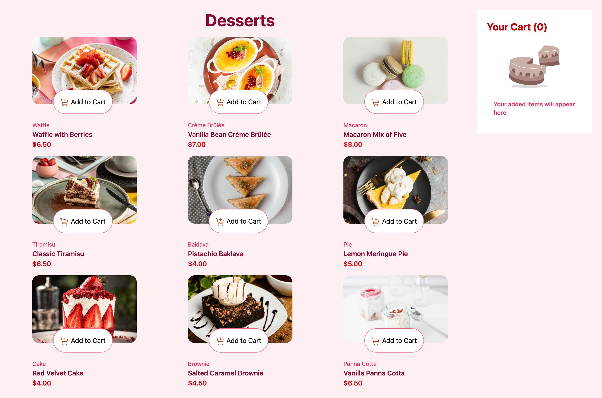
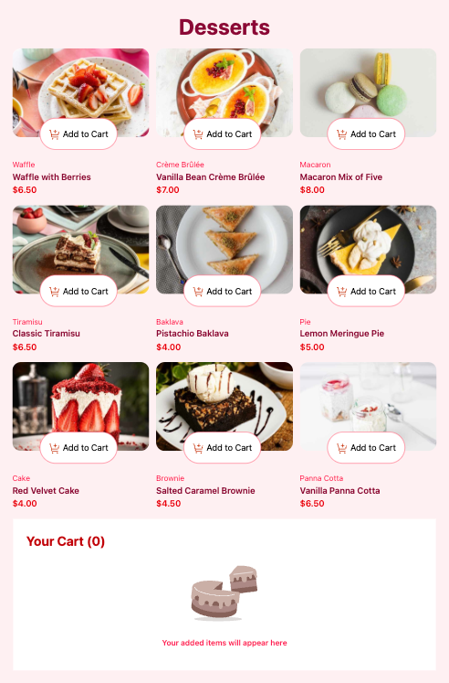
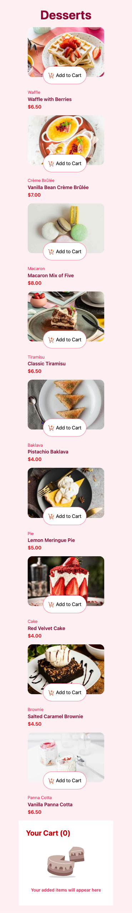

# Frontend Mentor - Product List with Cart Solution

This is my solution to the [Product list with cart challenge](https://www.frontendmentor.io/challenges/product-list-with-cart-5MmqLVAp_d) on Frontend Mentor. This challenge helped me strengthen my HTML, CSS, and responsive layout skills. I'm currently working on the JavaScript functionality.

## Table of Contents

- [Overview](#overview)
  - [The Challenge](#the-challenge)
  - [Screenshot](#screenshot)
  - [Links](#links)
- [My Process](#my-process)
  - [Built With](#built-with)
  - [What I Learned](#what-i-learned)
  - [Continued Development](#continued-development)
  - [Useful Resources](#useful-resources)
- [Author](#author)
- [Acknowledgments](#acknowledgments)

---

## Overview

### The Challenge

Users should be able to:

- ✅ Add items to the cart and remove them
- ✅ Increase/decrease the number of items in the cart
- ✅ See an order confirmation modal when they click "Confirm Order"
- ✅ Reset their selections when they click "Start New Order"
- ✅ View the optimal layout for the interface depending on their device's screen size
- ✅ See hover and focus states for all interactive elements on the page

### Screenshot





---

### Links

- 🧩 Solution Repo: [GitHub - wdpf-cart](https://github.com/EshrakRahman/wdpf-cart)
- 🔗 Live Demo: [wdpf-cart.netlify.app](https://wdpf-cart.netlify.app/)
- 🌐 Personal Website: [eshrak.me](https://eshrak.me)

---

## My Process

### Built With

- Semantic HTML5
- Tailwind CSS (utility-first)
- CSS Grid & Flexbox
- Mobile-first workflow
- Responsive design techniques
- Local fonts (TTF and variable)
- JavaScript (in progress)

---

### What I Learned

- How to load and use local and variable fonts with Tailwind
- Building complex, responsive grid layouts using custom `grid-template-rows/cols`
- Responsive design using `@media` variants in Tailwind (`sm:`, `md:`, `lg:`, `xl:`)
- Clean project structure using `/assets`, `/data`, and `/components` folders
- Setting up Tailwind CLI watch mode and controlling it (`Ctrl + C`)

```css
/* Example of grid row with fractional units */
.grid-rows-[8fr_2fr] {
  grid-template-rows: 8fr 2fr;
}

### Continued Development

- Finish JavaScript functionality (cart, modal, reset logic)
- Add transitions/animations with Tailwind and/or GSAP/Framer Motion
- Add accessibility improvements (keyboard navigation, ARIA labels)
- Consider refactoring into React or Vite for better scalability and component-based structure

### Useful Resources

- [Tailwind CSS Docs](https://tailwindcss.com/docs)
- [Frontend Mentor Community](https://www.frontendmentor.io/community)
- [CSS Grid Cheat Sheet - CSS Tricks](https://css-tricks.com/snippets/css/complete-guide-grid/)
- [Heroicons](https://heroicons.com) - great for UI icons

## Author

👨‍💻 Website: [eshrak.me](https://eshrak.me)  
🔗 Frontend Mentor: [@EshrakRahman](https://www.frontendmentor.io/profile/EshrakRahman)  
🐦 Twitter: [@yourusername](https://twitter.com/eshrakrahman) <!-- Update if needed -->

## Acknowledgments

Thanks to the Frontend Mentor team and community for these amazing challenges.  
Big shoutout to anyone who provides feedback on my solution — it's always appreciated!